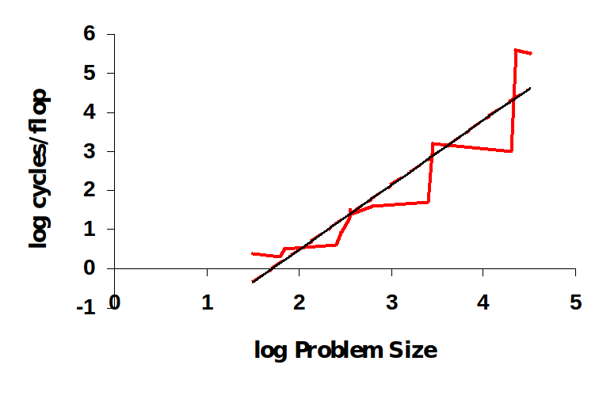

[GnuPlot](http://gnuplot.info/): é uma ferramenta open-source e free para criar gráficos 2D e 3D. 

Links úteis:
- Manual: http://gnuplot.info/docs_5.0/gnuplot.pdf
Demos: 
- average: http://gnuplot.sourceforge.net/demo_5.0/running_avg.html
- errorbars: http://gnuplot.sourceforge.net/demo_5.0/fit.html

[Exemplo](./test.dem) 
- Execute o comando gnuplot test.dem
- Analize o código e modifique-o a vontade.

 

Em sala foi apresentado um teste de desempenho no qual foi graficado o número de ciclos por flop de um algoritmo de multiplicação de matrizes em função do tamanho da matriz. Implemente uma versão desse algoritmo, meça o tempo de execução e verifique se ocomportamento é imilar ao do gráfico para diferentes valores de n.

* MAX FLOPS = (# Number of cores) * (Clock Frequency (cycles/sec) ) * (# FLOPS / cycle)

